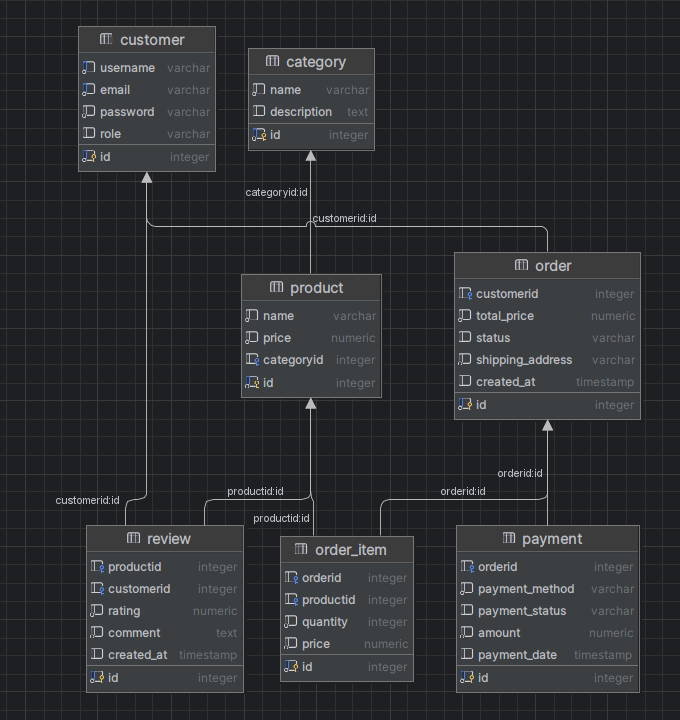

Описание проекта

Современный интернет-магазин кроссовок молодежных брендов. Здесь можно найти самые популярные модели от ведущих производителей.

📍 Развёрнутое приложение
[https://maxiiis1.onrender.com](https://m3308-fink.onrender.com)

Доменная область проекта — интернет-магазин кроссовок. Система позволяет пользователям выбирать товары, оформлять заказы, оставлять отзывы и производить оплату. Основные функции включают каталог товаров, систему категорий, управление заказами и отзывы клиентов.
Ключевые сущности и их описание:
1)Category (Категория)
Категории помогают группировать товары. Например: "Беговые", "Баскетбольные", "Повседневные".

2)Product (Товар)
Основная сущность, представляющая кроссовки в магазине. Связана с категорией.

3)Customer (Покупатель)
Пользователь системы, который может оформлять заказы и оставлять отзывы.

4)Order (Заказ)
Сущность, фиксирующая заказ пользователя, его статус и адрес доставки.

5)OrderItem (Позиция заказа)
Промежуточная сущность, связывающая заказ и конкретные товары с их количеством и ценой.

6)Payment (Платеж)
Сущность, отражающая способ и статус оплаты заказа.

7)Review (Отзыв)
Сущность для отзывов покупателей на товары.

Автор: Maxiiis1

